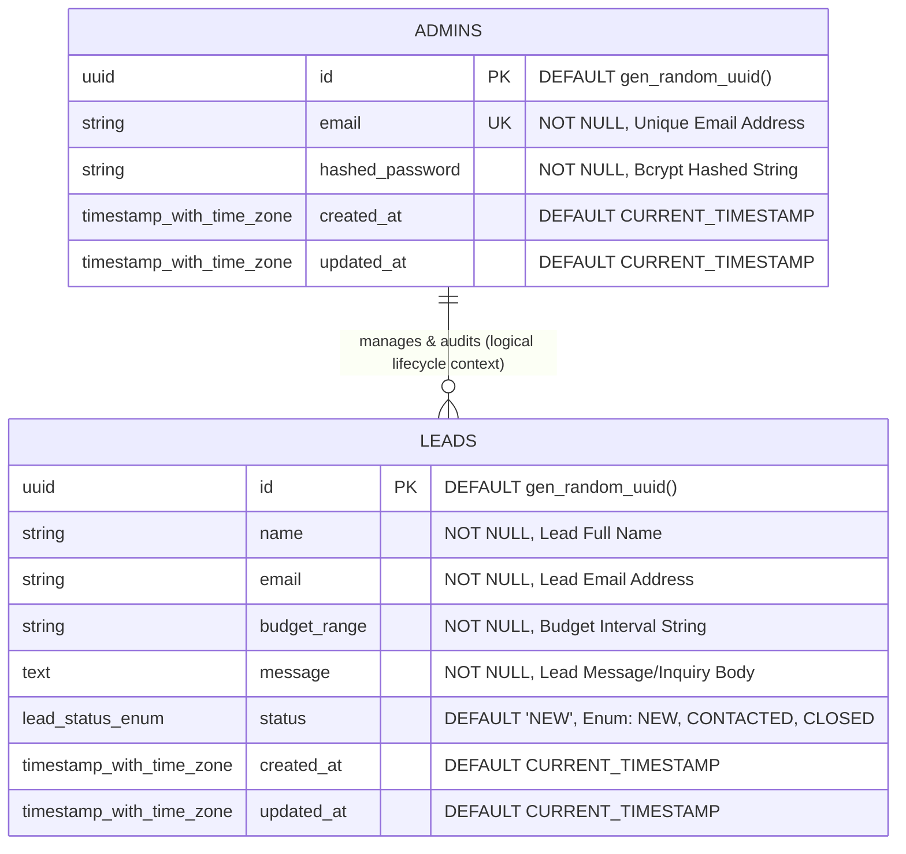

# Database Design & Schema Specification — LeadDesk Mini

This document defines the relational database architecture, entity relationships, field attributes, constraints, indices, and database triggers for **LeadDesk Mini** backed by **Neon PostgreSQL**.

---

## 1. Entity Relationship Diagram (ERD)



---

## 2. Table Specifications

### 2.1 Table: `admins`
Stores authenticated administrator credentials for logging into the LeadDesk Mini dashboard.

| Field | Data Type | Constraints | Default | Description |
|---|---|---|---|---|
| `id` | `UUID` | `PRIMARY KEY` | `gen_random_uuid()` | Unique identifier for admin record |
| `email` | `VARCHAR(255)` | `NOT NULL, UNIQUE` | None | Administrator email address used for login |
| `hashed_password` | `VARCHAR(255)` | `NOT NULL` | None | Salted Bcrypt password hash string |
| `created_at` | `TIMESTAMPTZ` | `NOT NULL` | `CURRENT_TIMESTAMP` | Account creation timestamp with UTC timezone |
| `updated_at` | `TIMESTAMPTZ` | `NOT NULL` | `CURRENT_TIMESTAMP` | Last profile update timestamp |

#### Indices & Constraints (`admins`)
- **`pk_admins`**: `PRIMARY KEY (id)`
- **`uq_admins_email`**: `UNIQUE INDEX (email)`

---

### 2.2 Table: `leads`
Stores all business inquiries submitted through the public landing page lead capture form.

| Field | Data Type | Constraints | Default | Description |
|---|---|---|---|---|
| `id` | `UUID` | `PRIMARY KEY` | `gen_random_uuid()` | Unique identifier for lead record |
| `name` | `VARCHAR(100)` | `NOT NULL` | None | Full name of the lead submitter |
| `email` | `VARCHAR(255)` | `NOT NULL` | None | Contact email address of the lead |
| `budget_range` | `VARCHAR(50)` | `NOT NULL` | None | Selected budget bracket (e.g. `$5k - $15k`) |
| `message` | `TEXT` | `NOT NULL` | None | Detailed project requirements / inquiry message |
| `status` | `lead_status_enum` | `NOT NULL` | `'NEW'` | Pipeline status (`NEW`, `CONTACTED`, `CLOSED`) |
| `created_at` | `TIMESTAMPTZ` | `NOT NULL` | `CURRENT_TIMESTAMP` | Submission timestamp with UTC timezone |
| `updated_at` | `TIMESTAMPTZ` | `NOT NULL` | `CURRENT_TIMESTAMP` | Last status modification timestamp |

#### Indices & Constraints (`leads`)
- **`pk_leads`**: `PRIMARY KEY (id)`
- **`idx_leads_status`**: `INDEX (status)` — Accelerates dashboard filter queries by lead status.
- **`idx_leads_created_at`**: `INDEX (created_at DESC)` — Accelerates default chronological dashboard sorting.
- **`idx_leads_search`**: `INDEX ON leads USING gin (to_tsvector('english', name || ' ' || email || ' ' || message))` — Enables high-performance full-text search across lead fields.

---

## 3. Enumerated Types (Enums)

### Custom Type: `lead_status_enum`

```sql
CREATE TYPE lead_status_enum AS ENUM (
    'NEW',
    'CONTACTED',
    'CLOSED'
);
```

#### Status Lifecycle State Transitions:
1. **`NEW`**: Default state assigned automatically upon visitor form submission.
2. **`CONTACTED`**: Assigned when an admin reaches out to the lead via email/phone.
3. **`CLOSED`**: Assigned when the lead conversation is concluded (deal won, lost, or qualified out).

---

## 4. Timestamps & Auto-Update Triggers

Both tables utilize PostgreSQL trigger functions to automatically update the `updated_at` timestamp column whenever a record row is modified.

### Trigger Function: `update_updated_at_column()`

```sql
CREATE OR REPLACE FUNCTION update_updated_at_column()
RETURNS TRIGGER AS $$
BEGIN
    NEW.updated_at = CURRENT_TIMESTAMP;
    RETURN NEW;
END;
$$ language 'plpgsql';

-- Attach trigger to leads table
CREATE TRIGGER update_leads_updated_at
    BEFORE UPDATE ON leads
    FOR EACH ROW
    EXECUTE FUNCTION update_updated_at_column();

-- Attach trigger to admins table
CREATE TRIGGER update_admins_updated_at
    BEFORE UPDATE ON admins
    FOR EACH ROW
    EXECUTE FUNCTION update_updated_at_column();
```

---

## 5. Schema Migration & Seeding Strategy

- **Migration Tool**: Alembic (Python database migration tool integrated with SQLAlchemy).
- **Initial Seed**: An administrative seed script (`scripts/seed_admin.py`) will check for existing admin records and initialize a default admin user if none exists:
  - Default Admin Email: `admin@leaddesk.com`
  - Password Hash: Bcrypt hashed initial seed password (configured via environment variable).
